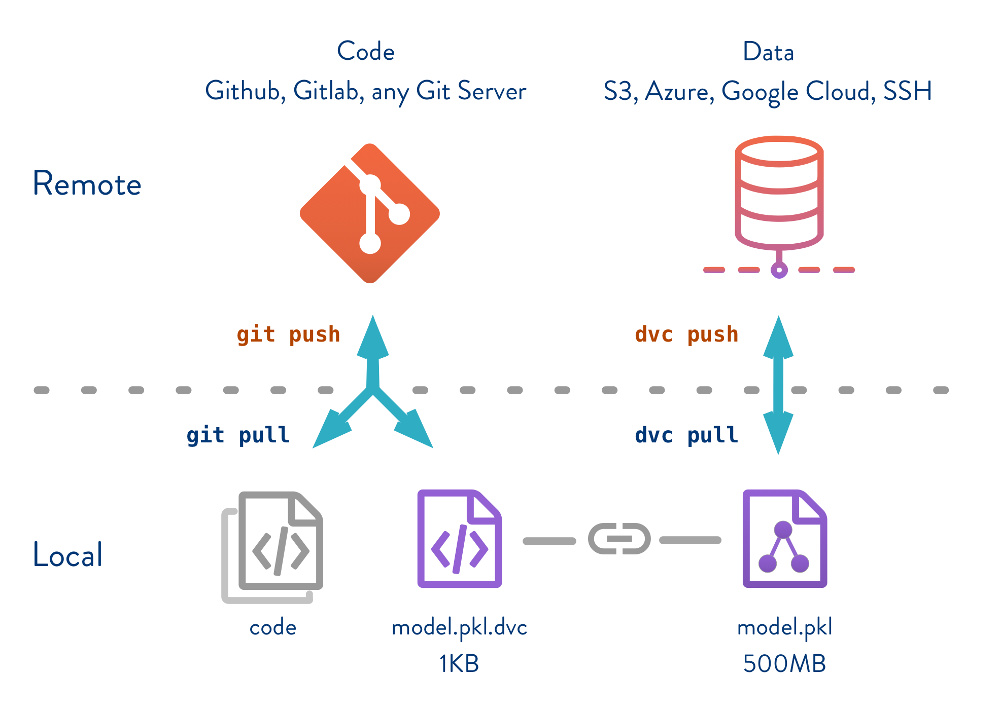

# Data Version Control for Machine Learning Projects

Data version Control (DVC) is a version control system that tracks large data sets and machine learning models with the aim to make ML models shareable and reproducible.

More information about DVC can be found on the official webpage <https://dvc.org/>

This repository shows you how to integrate dvc in your projects and hopefully you will not need to worry about where to store your data sets and models because github does not support more than 100mb.


source: image taken from [dvc](https://dvc.org/doc/use-cases/data-and-model-files-versioning)

## Get Started
In this guide we are going to focus on dataset/model versioning in simple steps, reproducibility will be released later in this guide, so stay tunned.

First clone this or any other repository, because dvc works on top of git repositories.

```bash
git clone https://github.com/jwilliamn/dvcML.git
cd dvcML
```

## 1. Install DVC
Once we have our repo, we install DVC. It is a good practice to install in an isolated environment i.e. `virtualenv` or `conda`.

```bash
pip install dvc
```

or from a requirements file
```bash
pip install -r requirements.txt
```

## 2. Initialize DVC
On the fresh repository, we initialize as follows.

```bash
dvc init
git commit -m "DVC initialized"
```

## 3. Configure Storage
You can start working right away in its local setup, however to share data and models the way you share code using github, we need to setup a remote storage. You can find the configuration for several storage types [here](https://dvc.org/doc/commands-reference/remote-add#examples).

This guide shows a configuration with azure blob storage.

First we need to install dvc azure dependencies (If you installed from requirements.txt in step 1, skip the following line.)
```bash
pip install "dvc[azure]"
```

```bash
dvc remote add myazure azure://my-container-name/path
dvc config core.remote myazure
dvc remote modify myazure connection_string my-connection-string --local
```
> `myazure` is the name of the remote storage, `my-container-name` is the name of the azure blob container i.e. dvcData. In order to get a connection with azure we need a connection string that should be placed instead of `my-connection-string` with the `--local` option to write in a non traceable config file.


## 4. Add Data
First we have to download some data to our repository. Here I am downloading SQuAD V1 data set (to train a question answering model, more info [here](https://github.com/jwilliamn/drqa-model.git))

```bash
mkdir SQuAD

wget https://rajpurkar.github.io/SQuAD-explorer/dataset/train-v1.1.json -P SQuAD/
wget https://rajpurkar.github.io/SQuAD-explorer/dataset/dev-v1.1.json -P SQuAD/
```

Now we run the `dvc add` command to take the data under DVC control.
```bash
dvc add SQuAD/
```

or 
```bash
dvc add -f path/to/SQuAD.dvc SQuAD/
```

This creates a `data.dvc` file that can be commited to **track versions of the data**. It also includes the data directory in the git ignore file.
```bash
git add SQuAD.dvc
git commit -m "data added to DVC"
```

## 5. Save and Share
Now that DVC manages the data, we can push to our configured remote storage and share with the team.
```bash
dvc push
```
If you make important changes to the data it is useful to run first `dvc commit` before `dvc push`.
```bash
dvc commit
dvc push
```
To save changes of the dvc files and code we run the normal git commands.
```bash
git add .
git commit -m "dvc files changed"
git push origin master
```

## 6. Retrieving Data
If you clone a repository make sure you have the dvc files or configure following steps 1 to 3. Then run the following command.

```bash
dvc pull
```
This will retrieve all data under DVC control.
If you want just one part of the data add the dvc file corresponding to that data.

```bash
dvc pull path/to/SQuAD.dvc
```